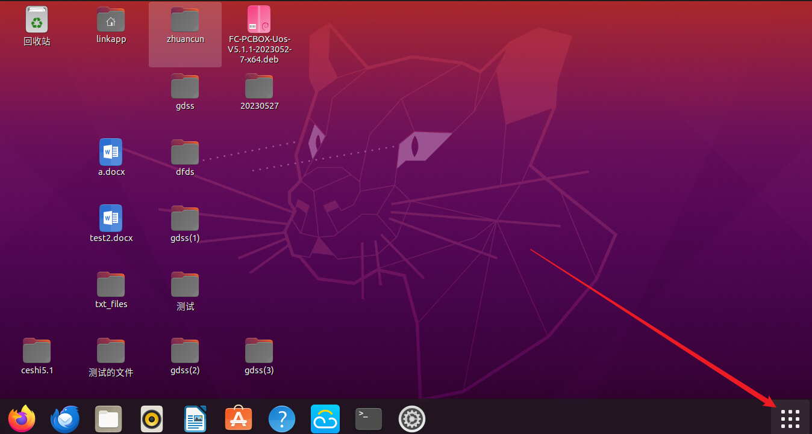
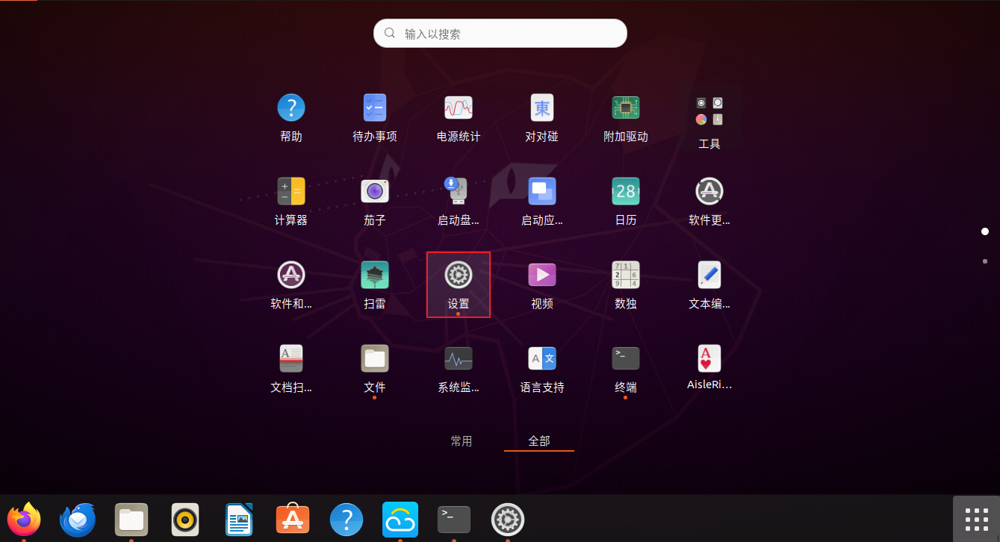
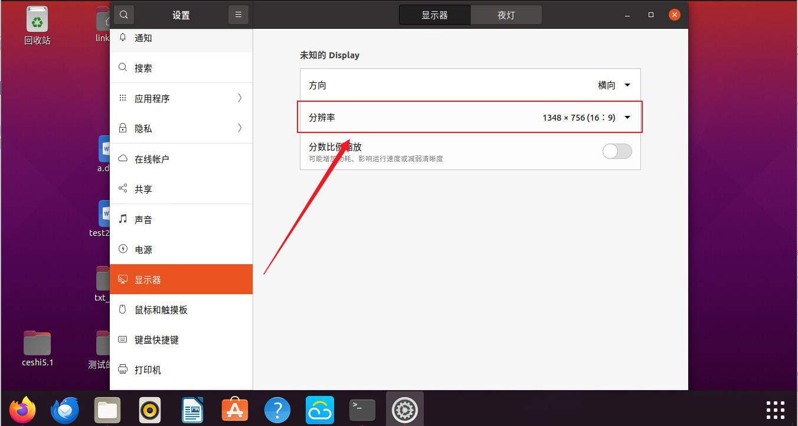
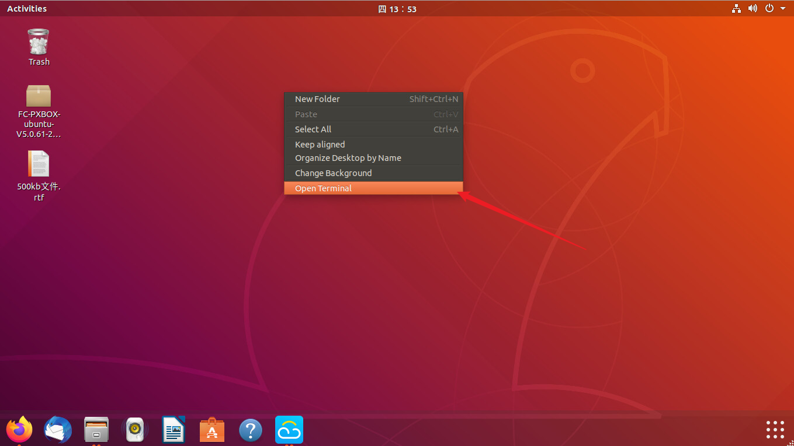
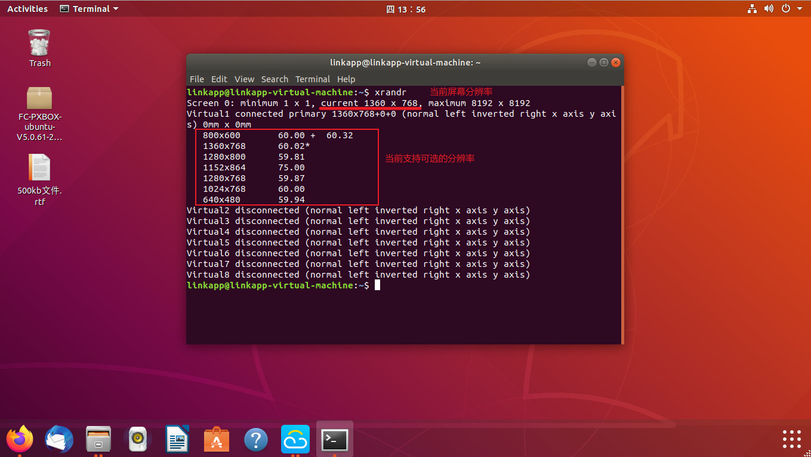

Ubuntu系统改变桌面分辨率
=================

两种方案(推荐直接使用终端修改)
-------------

	一、通过系统工具进行修改(部分版本不支持)
	二、通过终端进行修改  

### 一、通过系统工具进行修改(示例版本为Ubuntu20版本)

1.打开应用菜单

选择设置

在设置菜单中找到显示即可直接修改屏幕分辨率


### 二、通过终端进行修改 
桌面右键点击选择打开终端

输入命令：```xrandr```可以查看到当前屏幕分辨率的参数以及其他参数

可以输入命令```xrandr -s 想要修改的分辨率参数```
如：```xrandr -s 1280x800```注：是字母x
