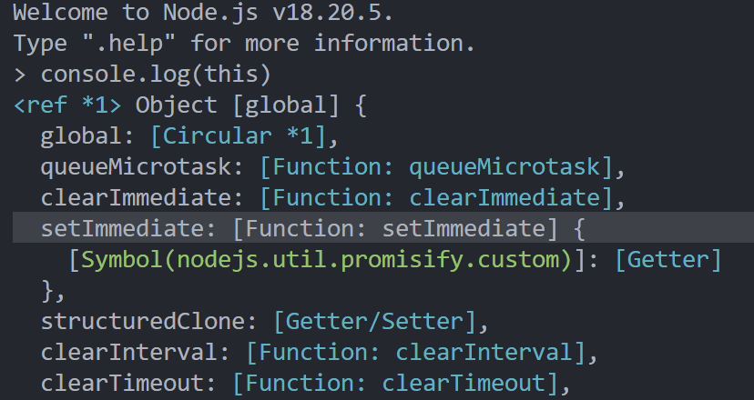
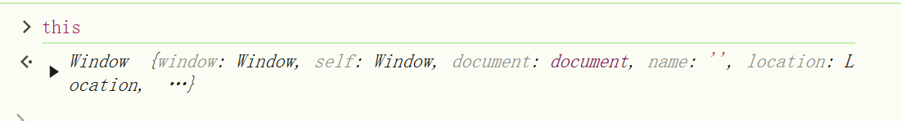

# 理解JavaScript中的this指向
this在JavaScript中是一个容易混淆的概念。理解this的关键在于它的绑定机制，它的值不是在函数定义是设置的，而是在函数使用时确定的。
## 1.全局中的上下文this
在全局代码中，this是指向的全局对象：
- 在浏览器中，this是指向的window对象。
- 在Nodejs中，this是指向global对象。
### 例：
```js
console.log(this)
```


## 2.函数调用中的this
当你调用一个普通函数时，this是指向全局对象（严格模式下为undefined）。
### 例：
```js
function func(){
	console.log(this) // 在浏览器中，非严格模式下指向window
}
func();
```
## 3.对象中的方法
当this被用在对象的方法中时，this会指向该对象本身。
### 例：
```js
const obj = {
	name:'laoli',
	getName(){
		console.log(this.name); // 输出 laoli
	}
}
obj.getName();
```
## 4.构造函数中的this
构造函数中的this会指向新创建的实例对象。
### 例：
```js
function Person(name){
	this.name = name;
}
const laoli = new Person('miss li');
console.log(laoli.name) // 输出 "miss li"
```
## 5.箭头函数中的this
箭头函数中的`this`也是由外部的上下文决定的，他没有自己的`this`，箭头函数会继承其所在的作用域的this。
```js
const obj = {
	name:'laoli',
	getName(){
		setTimeout(()=>{
			console.log(this.name); // 输出 laoli
		},0)
	},
	getName2(){
		setTimeout(function(){
			console.log(this.name); // 输出 undefined
		},0)
	}
}
obj.getName();
obj.getName2();
```
## 6.call、apply和bind
这三个方法可以让你显式的指定`this`的值。
- `call`立即调用函数，并传入`this`和参数。
- `apply`立即调用函数，并传入`this`和参数(参数以数组的形式传入)。
- `bind`返回一个新的函数，并固定`this`的指向，知道函数被调用。
### 例：
```js
function logPersonName(){
	console.log(this.name);
}
const obj = { name:'laoli'};
logPersonName.call(obj); // 立即执行输出 laoli
logPersonName.apply(obj); // 立即执行输出 laoli

const bindName = logPersonName.bind(obj)

bindName()//执行输出 laoli
```
----
## 总结 
`this`的值取决与函数的调用方式
- 在全局作用域中，`this`指向全局对象。
- 在对象中，`this`指向该对象。
- 在构造函数中，`this`指向新创建的实例。
- 在箭头函数中，`this`指向外部作用域。
- `apply`、`call`、`bind`可以手动的指定`this`。